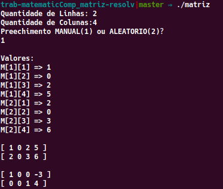

# Materia: Fundamentos de Matematica Aplicada a Computação

Turma: MR02

curso: Ciencias da Computação - UNIFACS 2017.1

Alunos: Reuter Junior e Vitor Mendonça

Objetivo: criar um programa que leia e calcule uma matriz e a transforme em uma matriz reduzida em forma de escada

## Como usar?

No terminal ou cmd usar: $ ./matriz

### Para compilar

Fazer as devidas alteracoes nos arquivos e depois usar: $ make ou $ make all

## Para teste

No input para equação teste os seguintes valores:

